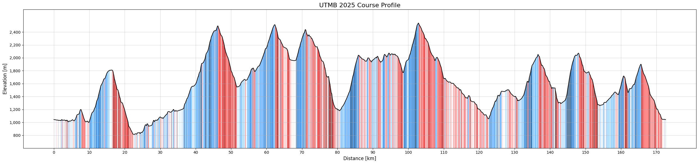

:::{=html}
<link rel="stylesheet" href="https://cdnjs.cloudflare.com/ajax/libs/font-awesome/6.5.1/css/all.min.css" integrity="sha512-9usAa8m0M+WyW59Ry...cut..." crossorigin="anonymous" referrerpolicy="no-referrer" />
:::

### Ultra-Trail du Mont-Blanc

**UTMB** (Ultra-Trail du Mont-Blanc) is often referred to as the most important event in trail running and described as the "Olympics of trail running". Every year in late August, Chamonix becomes the centre of the sport, as the world's best athletes gather to race around the Mont Blanc massif, crossing the mountains of France, Italy, and Switzerland. Alongside the elites, thousands of amateur runners chase the same dream.

The **UTMB Finals** is a full week of events with different distances and profiles. The main race - the UTMB itself, is around 170 km long with more than 10,000 meters of elevation gain, circling Mont Blanc. Alongside it are other iconic races such as CCC (Courmayeur-Champex-Chamonix, ~100 km) and OCC (Orsières-Champex-Chamonix, ~50 km), named after the key towns they connect, each attracting different types of runners depending on distance and specialization.

The route of the UTMB passes through several key mountain towns and checkpoints, including Courmayeur (Italy), Champex-Lac (Switzerland), and Les Houches (France), before returning to Chamonix. These points act as both logistical anchors and psychological milestones throughout the race.

The UTMB week is the final event of the broader **UTMB World Series**. The Finals in Chamonix represent the culmination of this system, while the World Series itself consists of qualifying races held around the world, where runners collect "Running Stones" by finishing selected events to earn a place in the draw for the start line. For many athletes, this becomes a multi-year process. In addition to the standard qualification route, many UTMB World Series races also reward top performers with automatic qualification to the Finals - typically podium finishers or winners, depending on the specific race and category.

### Course Profile

To better understand the course, I did a quick analysis of a 2025 GPX file of the UTMB route:

- Total distance: 172.6 km
- Elevation gain: 10,510 m
- Elevation per km: ~60.9 m/km
- Flat sections: ~8.2%
- Uphill sections: ~46.7%
- Downhill sections: ~45.1%

Flat terrain is almost negligible, and the course is dominated by continuous transitions between climbing and descending. Both components contain a wide range of gradients, from runnable sections to very steep segments, which makes pacing highly nonlinear across the entire race. Breaking the terrain down further, I classified slopes into categories based on gradient (%):

- Flat: (0, 1)%
- Very easy: (1, 3)%
- Easy: (3, 7)%
- Moderate: (7, 12)%
- Steep: (12, 20)%
- Very steep: (20, 30)%
- Extreme: (30, $\infty$)%

Using this discretization, the uphill and downhill distributions look as follows:

**Uphill sections**

- Extreme: 16.80%
- Very steep: 23.40%
- Steep: 27.90%
- Moderate: 16.74%
- Easy: 10.61%
- Very easy: 4.55%

**Downhill sections**

- Extreme: 15.11%
- Very steep: 21.51%
- Steep: 26.31%
- Moderate: 16.60%
- Easy: 13.75%
- Very easy: 6.73%

Overall, the course is far from uniform. Both climbs and descents are composed of mixed terrain, ranging from runnable to extremely technical sections, which makes simple pacing models insufficient on their own.

I also estimated what flat-equivalent **pacing** would look like for different finishing times:

* Top 10 (~21h): ~7:30 min/km
* Average finish (~39h): ~13:36 min/km
* Median (~40.5h): ~14:08 min/km
* Cutoff (~46h): ~15:59 min/km

Of course, these are purely flat-equivalent paces and do not reflect real effort distribution. However, they help illustrate just how different UTMB is from road marathons, where elevation, terrain variability, and fatigue accumulation dominate the actual pacing strategy.

{ class="click-zoom" }

### Motivation

As a trail runner myself, UTMB sits firmly among long-term goals, almost in the category of dreams that quietly shape how I train year after year. From an analytical perspective, it is also a fascinating system to study. My intention is to use this perspective to better understand both my training and the race itself, so I can meaningfully improve my chances of one day standing at the start line in Chamonix and racing it the way I want to.

```{=html}
<div class="project-link-container">
    <i class="fab fa-github"></i>
    <span>
    The code for this race profile analysis can be found in the GitHub repository under the 
    <a href="https://github.com/1312Bravo/Path-To-UTMB/tree/main/course_analysis" target="_blank">course_analysis</a>
    directory. The script <code>gpx_to_tabular.py</code> also contains a reusable function for <b>converting GPX files into tabular format</b>, which can be useful for analyzing other GPX tracks.
    </span>
</div>
```