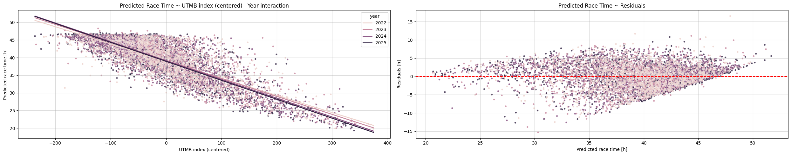
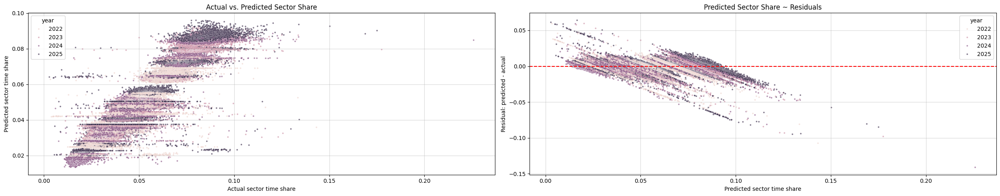
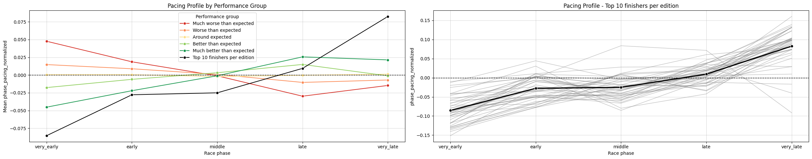

:::{=html}
<link rel="stylesheet" href="https://cdnjs.cloudflare.com/ajax/libs/font-awesome/6.5.1/css/all.min.css" integrity="sha512-9usAa8m0M+WyW59Ry...cut..." crossorigin="anonymous" referrerpolicy="no-referrer" />
:::

### The pacing question

Pacing advice in ultra running often sounds simple from the outside: start controlled, stay patient, do not get pulled into someone else's race. My coach used to frame this in a very practical way: trail running is not cycling. There is no meaningful draft advantage and very little reason to respond to the runners around you.That connects to one of the classic ultra-running ideas: over long enough distances, performance is not only about who can run fast, but who can avoid slowing down too much.

I wanted to test this idea in a structured way using UTMB data. Is it true that the best pacing strategy is the one that slows down the least? Or is that just a nice saying we repeat because it sounds sensible? 

The goal is to analyse **whether different pacing styles are associated with better or worse results** relative to a runner's ability. In other words: given how strong a runner is, which way of moving through the race seems to produce the best outcome?

The important phrase here is **relative to the runner's ability**. A top runner and a mid-pack runner have very different expected race times, so comparing their raw speeds would mostly tell us what we already know: stronger runners are faster. What matters for this analysis is whether each runner moved through the race better or worse than we would expect from their own level. In that sense, both an elite runner and a mid-pack runner can pace well, pace badly, start too hard, or finish stronger than expected.

So this analysis starts from a simple hypothesis: **the best pacing strategy is not necessarily the most aggressive one, but the one that preserves speed relative to the runner's ability for as long as possible.** 

### From finish time to race shape - Data

To test this, I combine two types of UTMB data from the **2022, 2023, 2024, and 2025** editions, both described in the [data collection post](data.qmd). The first is **[race result data](data.qmd#utmb-race-results)**: finishing time, rank, race status, and runner descriptive variables. The second is **[race/runner sector data](data.qmd#utmb-racerunner-sector-data)**: checkpoint-by-checkpoint timing, including when a runner arrived, when they left, how long they rested, and how long they spent moving through each part of the course.

Together, these data sources connect the final result with the shape of the race that produced it. The dataset contains **10,563 runner-race observations** from **9,528 unique runners**, and for each runner we can follow how the race unfolded sector by sector.

We focus on **finishers with usable sector data across the race**. In the raw data, **6,971 runners finished** which means about **66%** of runner-race observations ended with a finish. Across the four editions, the finisher share ranged from roughly **64% to 68%**. 

The important unit in the analysis is a **sector**: the part of the race between two checkpoints. Each sector has a distance, a position in the race, a course profile, and a recorded time for each runner. In other words, we can look not only at when a runner finished, but how their race was distributed across the course. For more detail on how the course is split into sectors and how those sectors relate to the terrain profile, see the [UTMB course profile post](utmb_course_profile.qmd).

Each sector contains two different kinds of time: moving time and rest time. For the main pacing analysis, I focus on **moving time through each sector**: from leaving the previous checkpoint to arriving at the next one. This keeps the analysis focused on the movement pattern itself, while rest strategy can be treated separately.

This makes it possible to move beyond final finishing time and ask more useful pacing questions. How did the runner distribute effort across specific parts of the race? Where did they hold speed, and where did they start to lose it? Most importantly for this analysis: are some pacing patterns associated with better or worse results relative to the runner's overall ability?

Before the pacing analysis, the sector data needed a small amount of cleanup and feature engineering. I standardized the sector timing fields, corrected rest-only checkpoints, added absolute and relative sector distance, and connected the sectors with the GPX-derived course profile to add terrain features such as elevation gain and loss. This gives each sector both a timing profile and a course profile.

### Race time normalization

The first thing we need is a fair way to define what a good or bad race was for a specific runner. That means we need a way to **compare finishing times across runners with different abilities**. A runner's final race time depends on pre-race ability, but also on the race edition: weather, conditions, and small course differences can shift the whole field.

We need to **normalize the runners race time**, so we can compare the performance of runners with different abilities and different race conditions. 

For that, we estimate a baseline expectation for each runner's finishing time. The question is: given this runner's pre-race ability, and given the edition they ran, how fast would we expect them to finish? Once we have that expectation, the actual finishing time can be interpreted relative to it.

To estimate that baseline, we use the **UTMB Index** as a measure of pre-race ability and the **race year** as a measure of race conditions. We also use their interaction, which allows the ability-time relationship itself to change by year: a 50-point difference in UTMB Index does not have to translate into exactly the same time difference in every edition of the race.

$$
\text{Race time} \sim \text{UTMB Index} + \text{Race year} + \text{UTMB Index}:\text{Race year}
$$

Once we have an expected race time, we can calculate the **race time residual**:

$$
\text{Residual} = \text{Expected race time} - \text{Actual race time}
$$

We use the opposite direction of the residuals than it is usually defined, so that a positive residual means the runner finished faster than expected, and a negative residual means the runner finished slower than expected.

{ class="click-zoom" }

The above diagnostic plot is mostly a sanity check. From the left panel we see a strong pattern in the expected direction: higher UTMB Index means lower expected race time. We also see that the year lines are not simply one common line. Some editions are shifted slightly up or down, which means the expected race time differs by year even for runners with similar UTMB Index values. Their slopes also differ slightly, which supports the decision to include the interaction term. This is also supported by the model coefficients and their p-values. This gives us a reasonable ability-and-year baseline before we start comparing pacing patterns.

The right panel shows the residuals around that baseline. Ideally, those residuals would look like noise: scattered around zero without a clear pattern. Here we still see some structure. Runners with shorter predicted race times tend to have more negative residuals, while runners with longer predicted race times tend to have more positive residuals. This means the normalization is not perfectly calibrated across the whole field.

This matters for the analysis. The normalized race-time score may partly reflect this calibration pattern, not only pacing quality. The model may be slightly too optimistic for some faster-predicted runners and slightly too pessimistic for some slower-predicted runners. Among runners with longer expected race times, finishing the race already selects a relatively successful group, because similar runners who struggled more are more likely to be missing from the finisher-only analysis because they DNFed.

So the metric is useful, but it should be interpreted as an ability-and-year adjusted outcome among finishers, not as a perfect individual performance score.

For the main analysis, we use a **relative version of the residual**:

$$
\text{Normalized race time} = 1 - \frac{\text{Actual race time}}{\text{Expected race time}}
$$

With the relative version, all race results are put onto the same comparable scale. One hour does not mean the same thing for every runner: being one hour faster than expected is a larger relative improvement for a 22-hour runner than for a 44-hour runner. By using percentages instead of hours, we can compare runners with very different expected finishing times more fairly. 

On this scale, 0.05 means the runner finished about 5% faster than expected, 0 means they finished almost exactly as expected, and -0.05 means they finished about 5% slower than expected.

Now, instead of asking only who was fastest overall, we can ask who performed better or worse than expected **relative to their own ability and other factors hiden in race edition**.

### Sector time normalization

At this point, we have a comparable race result for each runner. The next question is what kind of pacing produced those results: how runners moved through the course.

To answer this, we use sector data: how long each runner needed to move from one checkpoint to the next, together with the distance and profile of that part of the course. This gives us a checkpoint-by-checkpoint view of how each runner distributed their time across UTMB.

Raw sector times and sector distances are not enough on their own. A fast runner will usually be faster in every sector, so comparing raw sector times would mostly repeat the same information as the final race time. What we need instead is a way to compare how runners distributed their effort: where each runner spent **more or less time than expected**.

To compare sector times across runners with different abilities, we convert each sector time into a **sector time share** within that runner's race:

$$
\text{Sector time share} = \frac{\text{Sector moving time}}{\text{Runner's total moving time}}
$$

So if a runner spent 8% of their total moving time in one sector, that sector has a share of 0.08. These shares sum to 1 for each runner. 

**Pacing is a relative distribution problem**. It is not only about how fast a runner was in one sector, but how that sector fits into their whole race, and how that distribution compares with other runners. So we need two kinds of comparability: across runners within the same sector, and across sectors within the same runner's race.

Sector time shares give us the first part: they make runners more comparable within the same sector. But they do not fully solve the second part, because sectors are not comparable to each other. Spending 8% of total moving time in one sector may be completely normal if that sector is long, steep, or technical. Spending 8% in another sector may mean the runner lost a lot of time.

That is why we estimate an expected sector share: **given the sector, sector conditions and the runner's ability, what share of total moving time would we expect here?** Only after that can we say whether a runner spent more or less time than expected in a specific sector.

To estimate the expected sector share, we model sector time share as a function of the race year, the sector, and the runner's UTMB Index:

$$
\text{Sector time share} \sim \text{Race year}:\text{Sector} + \text{UTMB Index}:\text{Sector}
$$

The first part gives each sector its own baseline in each year - sectors are not equal units and same sector can change slightly by edition. The second part allows the relationship between ability and sector share to differ by sector. Stronger and slower runners do not necessarily distribute time across different terrain and race parts exactly the same way. We did not include independent year, UTMB index or sector effects, because the interaction terms already capture those effects and are more specific.

The predicted sector time shares are then normalized again so that they sum to 1 for each runner. This matters because sector shares are relative: if a runner spends more of their race in one part of the course, they must spend less somewhere else.

Then we calculate the **sector pacing residual**:

$$
\text{Sector pacing residual} = \text{Expected sector share} - \text{Actual sector share}
$$

Again, we use the direction where **higher means less time than expected**. A positive residual means the runner spent less of their total moving time in that sector than expected. A negative residual means they spent more of their total moving time there than expected. For example, if a runner was expected to spend 6% of their moving time in a sector but actually spent 5%, the residual is +0.01, or one percentage point less than expected.

{ class="click-zoom" }

The diagnostic plots help us check whether this normalization makes sense. In the left panel, each point is one runner-sector observation: the actual sector time share on the x-axis and the expected sector time share on the y-axis. The points are grouped into visible layers because the model gives each year-sector combination its own baseline expected share. Observations from the same sector and year tend to have similar predicted values, so they appear close together vertically. Within those layers, the UTMB Index by sector term allows the expected share to move slightly depending on runner ability. The horizontal spread then shows the actual sector shares: how much runners really spent in that sector.

The right panel shows the residuals around those expected shares. The residuals are not perfectly random, partly because sector shares are connected: every runner's shares must sum to 1, so spending extra share in one sector has to be balanced somewhere else. 

The residual pattern suggests that the model is more of a practical baseline than a perfect sector-by-sector explanation. A positive sector pacing value does not mean the runner was objectively fast in that sector. It means the runner spent **less of their own race** in that sector than expected, given the sector, year, and ability baseline. This is exactly what we need for the pacing question: how the race was distributed relative to expectation.

For the main pacing analysis, we again use the relative version of the residual - the **normalized sector pacing**:

$$
\text{Normalized sector pacing} = 1 - \frac{\text{Actual sector share}}{\text{Expected sector share}}
$$

This puts sectors with different expected shares onto a more comparable scale. Being one percentage point faster than expected is not the same thing in a sector that normally takes 2% of the race and in a sector that normally takes 9% of the race. The relative version expresses the difference as a proportion of the expected sector share.

On this scale:

- 0.20 means the runner spent about 20% less share than expected in that sector.
- 0 means the runner spent almost exactly the expected share.
- -0.20 means the runner spent about 20% more share than expected in that sector.

This normalized sector pacing score is the main sector-level metric used in the pacing analysis that follows.

### Pacing analysis

The real question we are asking ourselves is: **Which ways of distributing effort through UTMB are associated with better race outcomes?** The goal is to understand whether the runners who performed better followed a different pacing pattern from those who performed worse, relative to their pre-race abilities. 

At this point, we have two normalized quantities:

- **Normalized race time**, which tells us whether a runner finished better or worse than expected, given their ability and race edition.
- **Normalized sector pacing**, which tells us whether a runner spent more or less of their race than expected in each sector, given the sector, year, and ability baseline.

Sector-level pacing is detailed, but it can also be noisy and overwhelming. For easier analysis, we group sectors into broader **race phases**: larger parts of the race made from several neighboring sectors. This keeps the main race structure, while reducing the noise and abundance of individual checkpoints.

We split the course into five race phases based on distance. They are meant to represent roughly equal parts of the route, but we keep whole checkpoint-to-checkpoint sectors together. Because the UTMB course can vary slightly between editions, the values below are averaged across the years included in the analysis.

| Race phase | Course section | Distance | Elevation gain | Elevation loss |
|---|---:|---:|---:|---:|
| Very early | 0.0-31.7 km | 31.7 km (18.2%) | 1,695 m (16.1%) | 1,630 m (15.5%) |
| Early | 31.7-68.5 km | 36.8 km (21.1%) | 2,696 m (25.7%) | 1,793 m (17.1%) |
| Middle | 68.5-103.2 km | 34.7 km (19.9%) | 2,441 m (23.2%) | 2,276 m (21.7%) |
| Late | 103.2-137.8 km | 34.5 km (19.8%) | 1,549 m (14.7%) | 2,166 m (20.6%) |
| Very late | 137.8-174.3 km | 36.6 km (21.0%) | 2,128 m (20.3%) | 2,644 m (25.2%) |

The phases are not perfectly equal in effort. But they are close enough in distance and elevation gain to work as comparable race blocks, while still preserving real checkpoint-to-checkpoint sectors. This lets us turn sector-level pacing values into a smaller number of readable phases and see whether better and worse performances differ mainly early, late, or across the whole race.

To move from sector-level pacing to **phase-level pacing**, we aggregate the sector shares inside each phase. We do not sum or average the normalized sector pacing values directly, because sectors have different expected sizes. A small sector and a long sector should not receive the same weight just because both have one normalized pacing value.

Because sector times are expressed as shares of a runner's total moving time, the actual and expected shares can be summed across neighboring sectors. Larger sectors naturally receive more weight inside the phase. So for each phase we calculate:

$$
\text{Actual phase share} = \sum \text{Actual sector shares in the phase}
$$

$$
\text{Expected phase share} = \sum \text{Expected sector shares in the phase}
$$

Then we define **normalized phase-level pacing** in the same relative way as sector-level pacing:

$$
\text{Phase pacing} = 1 - \frac{\text{Actual phase share}}{\text{Expected phase share}}
$$

This keeps the interpretation consistent. A positive phase pacing value means the runner spent less of their total moving time in that phase than expected. A negative value means they spent more. With the phase-level pacing, we can say that runner spent less than expected in the early race, or more than expected in the late race. That is close to how pacing is usually discussed in real racing.

At this point, we have the two pieces we need for the pacing analysis. The normalized race-time score tells us whether a runner finished better or worse than expected, and the phase-level pacing values tell us where they spent more or less time than expected during the race. The question is whether better-than-expected runners distribute their race differently: whether they avoid losing too much time late, start more controlled, or simply keep the damage smaller across the whole course.

**Performance group analysis**

For the inital analysis, we **split finishers into five performance groups** based on quantiles of normalized race time. Each group therefore represents a different part of the ability-adjusted performance distribution: from runners who finished much slower than expected to runners who finished much faster than expected.

I also add one extra reference group: the top 10 finishers from each race edition, based on the raw race results. So this group contains 40 runners in total and represents the fastest runners overall, not the best ability-adjusted performances.

- Much worse than expected (20%)
- Worse than expected (20%)
- Around expected (20%)
- Better than expected (20%)
- Much better than expected (20%)
- Absolute top finishers (40 runners)

Before looking at the pacing profiles, it helps to see what kind of runners are in each group.

| Performance group | Rank range | Mean rank | UTMB Index range | Mean UTMB Index |
|---|---:|---:|---:|---:|
| Much worse than expected | 46-1,788 | 1,180 | 481-890 | 594 |
| Worse than expected | 12-1,783 | 1,119 | 441-906 | 547 |
| Around expected | 4-1,789 | 991 | 388-936 | 537 |
| Better than expected | 1-1,755 | 722 | 366-945 | 561 |
| Much better than expected | 2-1,718 | 339 | 334-905 | 615 |
| Top 10 finishers per edition | 1-10 | 6 | 840-945 | 888 |

The table shows that these groups are not just simple raw-result groups. Mean final rank improves as we move from worse-than-expected to better-than-expected performances, but the rank ranges still overlap a lot. The top-10 group is, as expected, the clear exception.

This also connects back to the race-time normalization diagnostics. There we saw that the residuals are not perfectly calibrated across the whole field, especially among runners with longer expected race times. If the better-than-expected groups were mainly a byproduct of that issue, we might expect them to look like slower raw-result groups. That is not what this summary suggests. Their mean ranks are lower than in the middle and worse-than-expected groups, so **the grouping is not simply separating slower finishers into the better-than-expected side**.

The table also shows that **better normalized performance groups tend to contain faster runners by raw result**: mean rank improves as we move from worse-than-expected to better-than-expected groups. This is not surprising. Normalization adjusts for ability and race edition, but it does not make raw performance irrelevant. A runner who performs better than expected is still likely to finish higher in the overall ranking, especially if they already started from a strong ability level. Better relative performance naturally tends to show up as a better final result too.

Then we can compare the average pacing profile of these groups across the five race phases.

{ class="click-zoom" }

The first pattern fits almost perfectly with the pacing idea from the introduction. Runners who finished much better than expected spent more of their race than expected early, especially in the very early phase, and **less than expected later**. In race terms, they seem to keep more in reserve for the later parts of the course. Runners who finished much worse than expected show the opposite pattern: less of the race early, more of it late. This looks like a race that was too aggressive for their ability, with the cost appearing later.

The **top-10 reference group** shows an even more extreme version of the same pattern on average. They spend clearly more share than expected early and clearly less share than expected in the very late phase. That makes sense: the fastest overall runners are not just surviving the second half, relative to the  baseline, they are still moving very efficiently late in the race.

But the individual lines are an important warning. Even among the top runners, the pattern is not automatic. There is visible variability, and some top-10 finishers still lose more than expected late in the race. So this is not a rule that every elite runner follows perfectly. It is an average tendency: the top group usually shifts less of the race into the final phase, but even at the front, UTMB can still make runners pay late.

**This plot should not be read as proof by itself**. If a runner has a bad race, the lost time has to appear somewhere, and in a long mountain ultra it often appears late. So the clean early-to-late gradient is not surprising. Still, the plot suggests the better-performing groups spend more of their expected time share in the opening phase and less later, their whole race distribution is shifted. That is consistent with the idea that some late-race problems may be connected to what happened much earlier, even if this plot alone cannot really prove that starting more controlled caused the better outcome.

This does not make the pattern meaningless. If the plot only showed separation in the very late phase, it would mostly tell us that bad races end badly. But the separation starts earlier than that. Better-performing groups already look more controlled in the opening phase: they stay more within what their ability level can support, which suggests that **the late-race difference may partly be prepared much earlier**.

**Pacing pattern features**

TODO

The performance-group plot gives a useful first picture, but it is still descriptive. It shows that better and worse performances have different pacing profiles, especially from early to late race. But it does not tell us which specific pacing behaviors matter most, or whether the visible pattern remains useful once we describe pacing more systematically.

So the next step is to turn the phase-level pacing values into a set of pacing features. Instead of looking only at five separate phase values, we can describe broader race behaviors: how hard a runner started, how much they slowed down, how strong their final phase was, whether their pacing was steady, and how much their race shifted from the first half to the second half.

The goal of this feature engineering step is not to build the most complex model possible. It is to translate the pacing profile into interpretable variables that connect better to real race language. Once we have those features, we can ask a more precise question: which pacing behaviors are most associated with better normalized race performance?


```{=html}
<div class="project-link-container">
    <i class="fab fa-github"></i>
    <span> You can find the full code for the strucuted analysis, on Path To UTMB Github repository under the
    <a href="https://github.com/1312Bravo/Path-To-UTMB/tree/main/pacing_strategy" target="_blank"> pacing_strategy</a>
     directory.</span>
</div>
```
