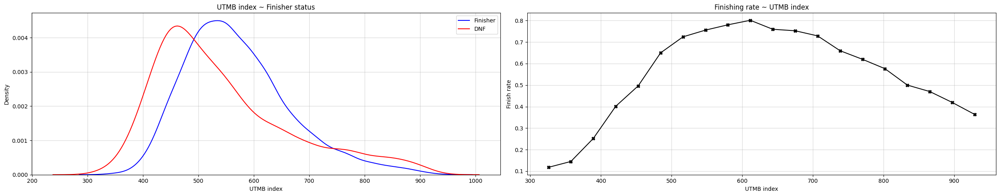
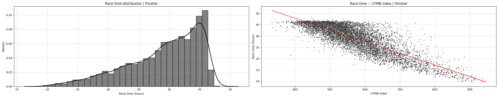
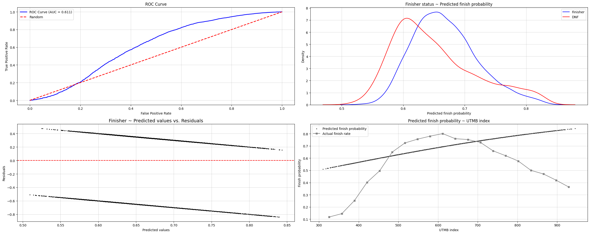
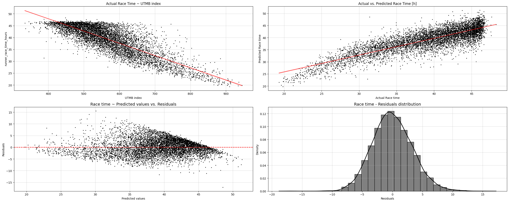
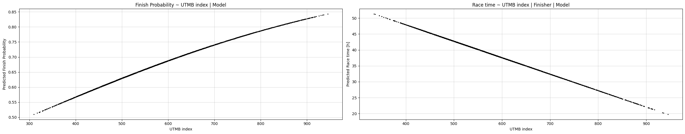
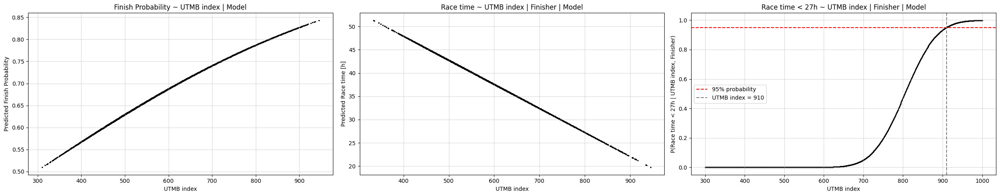

:::{=html}
<link rel="stylesheet" href="https://cdnjs.cloudflare.com/ajax/libs/font-awesome/6.5.1/css/all.min.css" integrity="sha512-9usAa8m0M+WyW59Ry...cut..." crossorigin="anonymous" referrerpolicy="no-referrer" />
:::

### Idea

Idea is simple: to arrive at the start line of UTMB only once I genuinely believe I am ready to not only run and finish it, but race it.

But what does "ready to race" actually mean? I defined it as ambitious benchmark: To believe I could finish under 27 hours with near certainty. That leads to a more concrete, mathematically clear and stated question. Since UTMB Index is the most widely used and accessible measure of trail running performance, what value would realistically indicate that a runner will finish the UTMB race in a sub-27 hour time?

To explore this, I collected results from UTMB races between 2022 and 2025. The dataset contains runners' 
- UTMB Index values, 
- finishing times and 
- final race status — whether they finished (finsher), withdrew (dnf), or were "broomed" (dnf)

The problem can be stated as a mathematical formula of findinng the UTMB index $x*$, such that 

$$
x* = \text{min}\{x: P(T \leq 27 | x) \geq 0.95\}
$$

So, minimum UTMB index, such that race time is lower than 27 hours with at least 95% probability.

The probability of race time under 27 hours, can thus be written as a product of two processes. 
- The runner first needs to finish the race.
- Conditional on finishing, the race has to be run under 27 hours.

$$
P(T \leq 27 | x) = P(\text{Finish}|x) \cdot P(T \leq 27 | x, \text{Finish})
$$

where $x$ denotes the UTMB index.

{ class="click-zoom" }

{ class="click-zoom" }

{ class="click-zoom" }

{ class="click-zoom" }

{ class="click-zoom" }

{ class="click-zoom" }