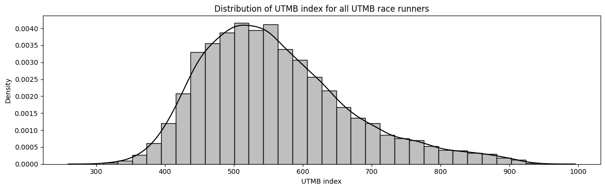

:::{=html}
<link rel="stylesheet" href="https://cdnjs.cloudflare.com/ajax/libs/font-awesome/6.5.1/css/all.min.css" integrity="sha512-9usAa8m0M+WyW59Ry...cut..." crossorigin="anonymous" referrerpolicy="no-referrer" />
:::

### Idea

Idea is simple: to arrive at the start line of UTMB only once I genuinely believe I am ready to not only run and finish it, but race it.

But what does "ready to race" actually mean? I defined it as ambitious benchmark: To believe I could finish under 27 hours with near certainty. That leads to a more concrete, mathematically clear and stated question. Since **UTMB index** is the most widely used and accessible measure of trail running performance, what value would realistically indicate that a runner will finish the UTMB race in a sub-27 hour time?

{ class="click-zoom" }

### A Definition of readiness

The problem can be stated as a mathematical formula of findinng the UTMB index $x*$, such that 

$$
x* = \text{min}\{x: P(T \leq 27 | x) \geq 0.95\}
$$

So, minimum UTMB index, such that race time is lower than 27 hours with at least 95% probability.

The probability of race time under 27 hours, can thus be written as a product of two processes. 
- The runner first needs to finish the race.
- Conditional on finishing, the race has to be run under 27 hours.

$$
P(T \leq 27 | x) = P(\text{Finish}|x) \cdot P(T \leq 27 | x, \text{Finish})
$$

where $x$ denotes the UTMB index.

### Methodology

We want to understand two relationships:

- How does the probability of finishing UTMB change with UTMB index?
- How does race time change with UTMB index among runners who finish?

The most straightforward approach would be to estimate these probabilities **empirically** from the observed data. For example, we could group runners by UTMB index and calculate the proportion of finishers or sub-27 hour performances within each group. The problem is that real-world data are noisy. Some UTMB index ranges contain hundreds of runners, while others, particularly at the highest performance levels, contain only a handful. As a result, empirical probabilities become unstable estimates and highly sensitive to random variation. Furthermore, empirical estimates provide no natural way to interpolate between observed values, extrapolate beyond them, or quantify uncertainty.

My goal is not only to describe what happened in the historical data, but to estimate the underlying relationship between UTMB index and race outcomes. I want to move from a collection of individual observations to a model of performance. A **statistical model** provides exactly that. By combining information across all runners, it produces a smooth and continuous relationship between UTMB index and probability. This allows us to estimate probabilities for any UTMB index value, not only those directly observed in the dataset, and provides a framework for reasoning about uncertainty.

We model two separate processes:

- $P(\text{Finish}|x)$ and
- $P(T | x, \text{Finish})$,

where $x$ denotes the UTMB index and $T$ the finishing time.

For the survival component, whether a runner reaches the finish line at all, I will use **logistic regression**. For the performance component, race time conditional on successfully finishing, I will use a **linear regression** model. Besides being interpretable, the linear model provides a direct way to transform predicted finish times into probabilities of running under a given target time, such as 27 hours.

The objective is therefore not to perfectly reproduce every historical result, but rather to estimate the underlying survival and performance mechanisms that generated those results.

**Why not use survival analysis?**

At first glance, this appears to be a textbook survival-analysis problem. Race time can be viewed as a time-to-event variable, and runners who don't could be treated as censored observations. The dataset also contains the checkpoint and time at which runners withdrew or were removed from the race.

In classical survival analysis, censoring typically means that the event of interest has not yet been observed. A DNF at UTMB is different: it is not an unknown finishing time, but a failure to finish. The fact that a runner managed to stay in the race for 20, 30, or 40 hours before dropping out does not necessarily provide information about what their finishing time would have been.

For this reason, I prefer to treat finishing and performance as two separate processes.

### Data preparation

To explore this, I collected results from UTMB races between 2022 and 2025. Each observation corresponds to a runner in a given race edition and includes:
- UTMB Index values, 
- finishing times and 
- final race status — whether they finished, withdrew, or were "broomed"

Overall,the dataset contains 10,363 valid observations. 

For modeling purposes, both DNFs and brooming are treated as non-finishes, resulting in a binary outcome variable indicating whether a runner successfully completed the race. Finishing time is only observed for runners who completed the race.

The dataset spans multiple UTMB editions, meaning that race-specific conditions such as weather and terrain difficulty are implicitly embedded in the observed variability of outcomes. In some editions with extreme weather, the course may also be slightly adjusted. 

### Finish probability

In the data, the overall finish rate is 65.99%. The average UTMB index of finishers is 571, compared to 542 of non finishers. The difference is relatively small, considering the spread of UTMB race runners' UTMB index. This suggests that UTMB Index alone provides only limited separation between finishers and non-finishers.

A very small difference, considering the distribution of the UTMB index among runners.

{ class="click-zoom" }

We model finish probability using a simple logistic regression **Finish ~ UTMB index**: 

$$P(\text{Finish}) = \frac{1}{1+e^{-(\alpha + \beta \cdot \text{UTMB index})}}$$
or 
$$log(\frac{p}{1-p}) = \alpha + \beta \cdot \text{UTMB index}$$

The estimated **coefficient UTMB index** is 0.0026, meaning that each additional point in UTMB index increases the odds of finishing by 0.26% multiplicatively (odds ratio $e^{0.0026}$ $\approx$ 1.0026) in average. A 100-point increase in UTMB index multiplies the odds of finishing by about ($(e^{0.0026})^{100}$) $\approx$ 1.30 in average. The standard error is 0.0002, indicating that the coefficient is precisely estimated, despite the small effect size.

The model achieves a $\text{Pseudo R}^2$ of 0.0125 and ROC-AUC of 0.611, where 0.5 corresponds to random classification. This indicates that UTMB index contains some predictive signal for finishing, but the explanatory power is limited.

Before drawing conclusions from the model, we need to evaluate whether its assumptions are consistent with the observed data. This provides a sanity check on whether the logistic functional form is appropriate and whether UTMB Index contains sufficient signal to justify probabilistic interpretation.

{ class="click-zoom" }

The diagnostics suggest that the model has limited but non-trivial ability to distinguish finishers from non-finishers. The separation between the classes from predicted probabilities is clear but imperfect. This indicates that UTMB index alone is insufficient to deterministically classify race completion. 

There is no strong systematic deviations from residual plot, suggesting that the logistic functional form is broadly appropriate. However, the empirical calibration curve shows deviations at higher UTMB Index values, where the data becomes sparser and more variable. These deviations are driven by limited sample size in the elite range and increased outcome variability among top-level runners, where strategic risk-taking and race dynamics can lead to higher dropout rates.

The diagnostics suggest that the model has limited but non-trivial ability to distinguish finishers from non-finishers. The moderate AUC and overlapping probability distributions indicate substantial unexplained variability, but the signal is significant. The residual plot suggests that the logistic functional form is broadly appropriate. Predicted finish rates across UTMB index shows that the model captures the overall increasing trend in finish probability, however deviations at high UTMB index, where data is more sparse, indicates mild calibration imperfections. This is also because the data "imperfection" - where elites are pushing extensively and also rather DNF than finish low.

Overall, the diagnostics support proceeding with a probabilistic modeling framework, while acknowledging that UTMB Index is only a partial predictor of race outcome.

### Race time conditional on finishing

In the data, among finishers, the average race time is 39.11 hours, making the target of sub 27 hours a relatively ambitious outcome. Only 4.56% of finishers achieve a time below this threshold.

Runners achieving sub-27 hour performances have in average UTMB index 803, with the lowest of 667. While within runners with over 27h of race time, UTMB index extends from 334 to 884 with average of 559. 

This large overlap suggests that UTMB Index is strongly correlated with performance, but far from deterministically predictive of race time.

{ class="click-zoom" }

We model race time among finishers using a simple linear regression **Race time ~ UTMB index | Finish**:

$$\text{Race time} = \alpha + \beta \cdot \text{UTMB index},$$

conditional on finishing.

The estimated **coefficient for UTMB Index** is -0.0517, meaning that each additional point in UTMB index means approximately 0.0517 hours ($\approx$ 3.1 minutes) faster race time in average. Meaning a 100-point difference in UTMB index corresponds to an expected 5.17-hour faster race time in average. The confidence interval of [-0.0525, -0.0509] indicates a stable and well-identified relationship between UTMB Index and race time among finishers.

The model explains a substantial portion of variability in race time, with an $R^2$ of 0.6947. The Pearson correlation coefficient of 0.8335 confirms a strong linear relationship between UTMB Index and finishing time among finishers. 

Similar to logistic model, also linear regression model operates on certain assumptions that must be met before drawing conclusions. 

{ class="click-zoom" }

There is a strong negative relationship between UTMB index and finishing time. There is seen cuttoff time at 46 hours. The relationship is broadly linear, which suggests that the linear functional form is appropriate as an approximation of the underlying relationship. The model captures the overall race time trend well. However, the spread suggests that individual-level variability remains substantial, which is expected. 

The residual plot reveals mild heteroskedasticity - the variance of residuals is not constant across predicted values, but instead changes with UTMB index. This suggests that the linear model captures the mean trend well, but does not fully account for variability differences across the performance spectrum. 

The relationship may not be perfectly linear across the entire range of UTMB index values. This is consistent with the idea that performance gains may not be strictly constant across all ability levels, and that marginal improvements in UTMB Index may translate differently at elite versus mid-pack levels.

Overall, while the diagnostics reveal mild deviations from ideal linear regression assumptions, these issues are not severe enough to invalidate the model. The residual patterns do not indicate systematic model failure, but rather expected variability in endurance performance data. The model captures the dominant signal in the data and provides stable, interpretable estimates of the average relationship between UTMB index and race time.

### Probability of sub-27 hour race time time

{ class="click-zoom" }

{ class="click-zoom" }