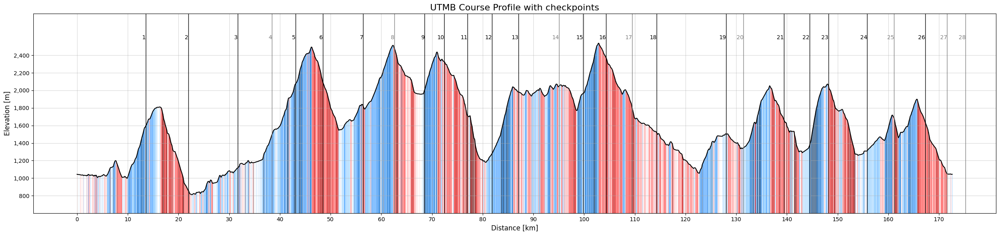

:::{=html}
<link rel="stylesheet" href="https://cdnjs.cloudflare.com/ajax/libs/font-awesome/6.5.1/css/all.min.css" integrity="sha512-9usAa8m0M+WyW59Ry...cut..." crossorigin="anonymous" referrerpolicy="no-referrer" />
:::

### What are we actually trying to race?

UTMB is usually described with two numbers: roughly **170 km** and more than **10,000 meters of climbing**. What makes the course additionally interesting is the way it keeps changing: long climbs, steep descents, runnable sections, technical terrain and very few sections where pace can be interpreted without terrain context.

The route can vary slightly from year to year because of weather, safety decisions, or local course adjustments, but the main structure of the race remains almost constant. So the course is stable enough that the **2025 GPX file** can be used as a representative version of the UTMB course.

### Data

The GPX file was converted into tabular data using the reusable [`gpx_to_tabular()` function](https://github.com/1312Bravo/Path-To-UTMB/blob/main/helper_functions/gpx_to_tabular.py) from the Path To UTMB repository. The function is not UTMB-specific, so it can be used for any GPX file, which makes it useful for analyzing other courses as well.

The GPX-derived course points were then connected with UTMB checkpoint and sector data from the 2022 to 2025 race editions. This sector data comes from the UTMB race and runner sector dataset described in the [data collection post](data.qmd). By matching the checkpoint distances to the GPX profile, we can estimate additional sector-level features such as elevation gain, elevation loss, and position on the course.

**Checkpoint IDs** are not perfectly stable across years. Some repeated checkpoint IDs refer to very similar course positions, while others shift along the course. Because of that, we keep sectors year-specific for analysis, while using averaged checkpoint positions for the repeated IDs only for presentation.

### Course Profile

The rough summary of the UTMB course profile is approximately:

::: {.compact-table}
| Metric | Value |
|---|---:|
| Distance | 172.6 km |
| Elevation gain | 10,510 m |
| Elevation loss | 10,509 m |
| Minimum elevation | 810 m |
| Maximum elevation | 2,538 m |
| Elevation range | 1,727 m |
| Elevation gain per km | 60.9 m/km |
| Total vertical change per km | 121.8 m/km |
:::

What additionally stands out is the vertical density. The course is constantly moving up or down. On average, every kilometer contains about 122 meters of total vertical change when gain and loss are combined. That explains why normal pace becomes a weak description of effort. Flat terrain is rare, and most of the climbing and descending is not gentle. Downhill does not simply mean "free speed". Many of the descents create their own muscular and technical cost, especially late in the race.

::: {.compact-table}
| Slope category | Gradient | Uphill share | Downhill share |
|---|---:|---:|---:|
| Very easy | 1-3% | 4.55% | 6.73% |
| Easy | 3-7% | 10.61% | 13.75% |
| Moderate | 7-12% | 16.74% | 16.60% |
| Steep | 12-20% | 27.90% | 26.31% |
| Very steep | 20-30% | 23.40% | 21.51% |
| Extreme | >30% | 16.80% | 15.11% |
:::

The **course profile plot** combines the GPX-derived elevation profile with the checkpoint and sector information from the race data. The colored areas indicate the local slope category. Vertical checkpoint lines mark the approximate sector boundaries, using averaged checkpoint positions for the repeated checkpoints across the considered race editions.

The plot also shows something that is easy to miss in a table. UTMB is a mountain route from valley to valley, not a long road race with some climbing added on top. The course repeatedly drops into lower villages and then climbs back above 2,000 meters, with the highest point around 2,550 meters above sea level. That shape matters: the race is not only long and steep, but also alpine, exposed, and technical in a way that changes how each section should be understood.

{ class="click-zoom" }

One simple way to feel the scale of the race is to convert **typical finishing times** into average pace over the full course distance. They are useful reference points. On UTMB, pace only makes sense together with terrain context.

::: {.compact-table}
| Finish-time reference | Race time | Flat-equivalent pace |
|---|---:|---:|
| Top 10 race time | 21.7 h | 7.55 min/km |
| Top 100 race time | 27.9 h | 9.69 min/km |
| Average finish time | 39.0 h | 13.56 min/km |
| Median finish time | 40.5 h | 14.08 min/km |
| Cutoff time | 47.0 h | 16.34 min/km |
:::

### Conclusion

The main lesson is that UTMB cannot be reduced to distance and elevation gain alone. Those numbers are useful, but they hide the structure of the race: almost no flat terrain, repeated transitions between climbing and descending, and many sections where the gradient is steep enough to change what pace actually means.

This is important for the rest of the project. If we later want to model pacing, compare runners, or estimate what a certain finishing time requires, the course has to be treated as a sequence of terrain-specific problems rather than one continuous 172 km effort. A kilometer on a runnable valley section and a kilometer on a steep technical descent are not the same unit. This gives the race a shape before building models on top of it. Any useful pacing or performance analysis needs to respect that.

