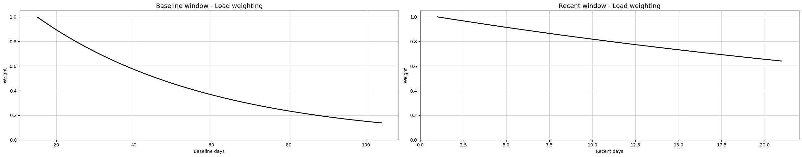
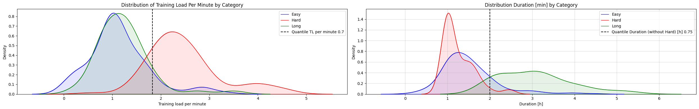
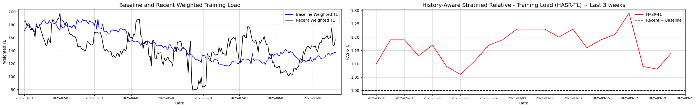
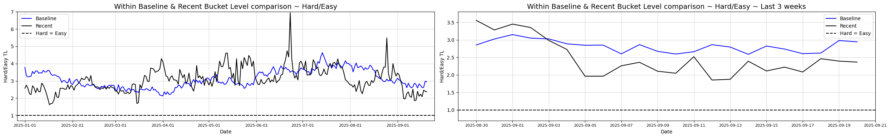
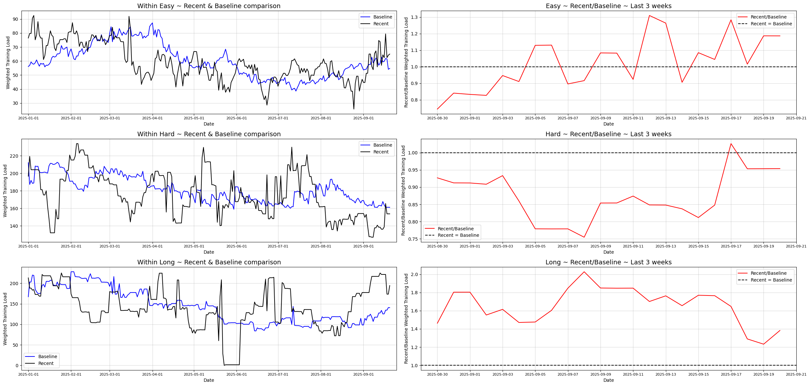
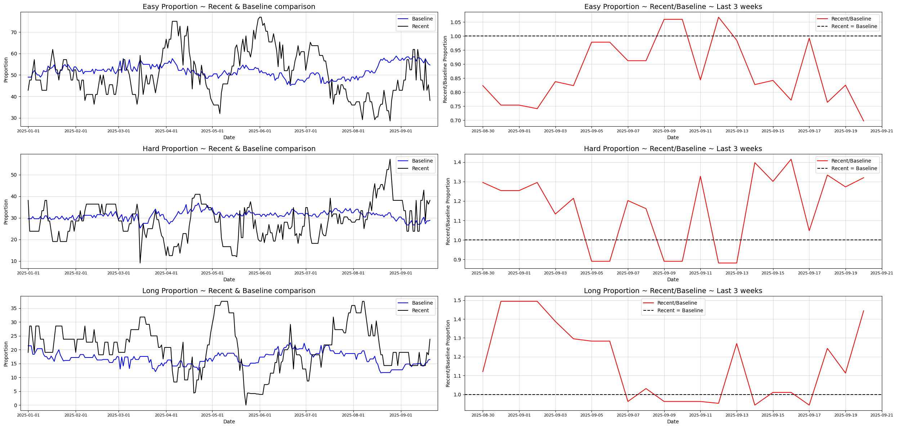

:::{=html}
<link rel="stylesheet" href="https://cdnjs.cloudflare.com/ajax/libs/font-awesome/6.5.1/css/all.min.css" integrity="sha512-9usAa8m0M+WyW59Ry...cut..." crossorigin="anonymous" referrerpolicy="no-referrer" />
:::


### Idea

When training for endurance sports, our bodies adapt over time, and whether a workout is "hard" or "easy" on the body, depends on what we’ve been doing recently and historically.  The goal is to define a simple metric that shows where we are with our current training compared to what we've been doing in the recent past. The purpose is to:

- see if we should reduce our training load so that we don’t overreach or risk injury,
- increase it to match what our body has adapted to in the recent past, or
- simply define where we are in the training cycle when taking the bigger picture into account.

The idea of comparing current workload to past workload isn’t new. Sports science has long used the Acute:Chronic Workload Ratio (ACWR) to capture how today’s training compares to longer-term training history. But ACWR has well-known limitations: it usually relies on a single rolling average, and it can miss important context about peak efforts or variation in load. That’s where our approach comes in. We'll further extend it into a more flexible and informative framework.

### Selecting the metric: 

To measure effort, we focus on **Training Load**, a metric that combines all other measures (options: distance, time, heart rate, pace or something else) into a single number. This also strongly coincides with the sport we are analyzing - trail running, where it is hard to judge intensity from speed or distance alone. We might talk more about Training Load in further blogs.

Training Load is provided from all of ours smart wearables and a practical way for making comparisons across very different sessions (and sports). We will use Garmin's Training Load values provided in our training log.

The same approach can be applied to any other training metric. And by calculating values for each, we can see the story from multiple angles.

### Deep dive

Let $TL_i$ be the training load of the day $i$ and $D_i$ be session duration in minutes on day $i$. We then define Training load per minute for day $i$ as $TL_i^{min} = \frac{TL_i}{D_i}$.

Our goal is to define a metric that normalizes recent TL against historical. We can think of this in two complementary components:

- **Baseline (long term) adaptation** - Load the body has been succesfully adapted to over a longer period, assuming this distribution is "safe", disregarding recent acute load.

    - Denoted as $X_{\text{baseline},t}$, where $X \in \{TL, D, TL^{min}\}$.
    - Computed over a long baseline window of $N$ days, excluding last $n$ days: $$\mathcal{X}_{\text{baseline},t}=\{X_{t-(n+j)}\mid j=1,\dots, N\}$$
    - To give more importance to recent training within the baseline period, we assign weights decreasing with days: $$w_j = \lambda^{j-1}, \quad 0 < \lambda <= 1, \quad j = 1, ..., N,$$ where more recent baseline days contribute more to defining the baseline load.

- **Recent training pattern** - Load the body is currently being exposed to, capturing acute training load.

    - Denoted as $X_{\text{recent},t}$, where $X \in \{TL, D, TL^{min}\}$.
    - Computed over a recent window of $n$ days: $$\mathcal{X}_{\text{recent},t}=\{X_{t-j}\mid j=1,\dots,n\}$$.
    - This can also be weighted to emphasize the most recent sessions: $$v_j = \lambda^{j-1}, \quad 0 < \lambda <= 1, \quad j = 1, ..., n$$

We define the **parameters** as:

- Baseline window: $N = 90$ days
- Recent window: $n = 14$ days
- Weight base $\lambda$ = $(0.5)^\frac{1}{31} = 0.978$, so weight halves approximately every 31 days.

Additionally: Because we aim to capture relative load patterns rather than total accumulated load, we normalize the weights so that they sum to 1. This ensures that the weighted, for example averages, for baseline and recent windows are directly comparable: 

- $\overline{w}_j = \frac{w_j}{\sum_{k=1}^{N}w_k} \quad j = 1, ..., N$
- $\overline{v}_j = \frac{v_j}{\sum_{k=1}^{v}w_k} \quad j = 1, ..., v$

{ class="click-zoom" }

Notes: By keeping the baseline and recent windows non-overlapping, we ensure that the baseline reflects only training the body has already adapted to, without being influenced by recent sessions that the body has not yet adjusted to. This allows us to identify increases in stress in the recent window that may pose a risk.

Dataset: We take into account all measured activities, regardless if it was real training or not (including hiking, swimming, easy cycling etc.) and treat each activity as an individual sample - same as in the activities log.  

### Percentile stratified metric

In endurance sports, training days can be grouped into a few main types:

- **Easy sessions & Rest days** - used for recovery, aerobic base, and technique work. In majority of athletes, these make up roughly 60% of all sessions.
- **Hard sessions** - tempo, threshold, VO2max, or interval workouts. Typically around 25% of sessions.
- **Long days** - the occasional very long run, bike ride, or race that forms the extreme right tail of the distribution. About 15% of sessions.

By tracking these session types separately we can see if:

- easy sessins are getting too long, too intense, or too rare, ensuring that we can perform well in harder workouts,
- or recent hard sessions make up a reasonable portion of total sessions to allow sufficient recovery,
- or recent long days are not too frequent or extreme.

Instead of using fixed cutoffs, we will classify sessions relative to an athlete's training history. As the baseline window represents the training distribution the athlete's body is adapted to, we will use the baseline window to define training classification thresholds. Then we will apply these baseline thresholds on the recent window that represents the training we want to evaluate.

- This ensures the baseline distribution reflects the training the body has already adapted to, providing a safe reference.
- Recent sessions are evaluated relative to this safe baseline, so any increase in intensity, frequency, or duration signals higher acute load or potential risk.

Based on my training data, with a "feel based" hardcoded mapping into the categories Rest, Easy, Hard, Long, and Other, the distribution of training loads and their descriptive values are as follows:

- Rest - 13% of days, averages = TL per minute 0, Duration [h] 0, TL 0
- Easy - 50% of days, averages = TL per minute 1.14, Duration [h] 1.5, TL 87.0
- Hard - 22% of days, averages = TL per minute 2.47, Duration [h] 1.25, TL 171.6
- Long - 12% of days, averages = TL per minute 1.23, Duration [h] 3.07, TL 197.8
- Other - 3% of days, averages = TL per minute 1.03, Duration [h] 2.31, TL 93.9

{ class="click-zoom" }

Formally, let $\mathcal{Q}^w_p(\cdot)$ be weighted $p$-th quantile operator. We define **baseline and recent buckets** using weighted quantiles over the baseline window of ${TL^{min}}$ and $D$ values, with weights $w_j$, using the baseline quantile values as follows:

1. To distinguish Hard sessions from Easy and Long, we calculate **Weighted Training Load per minute quantile** over the baseline window:
    $$q^w_{TL^{min},t} = Q^w_p(TL^{min}_{\text{baseline},t}, w_j)$$

2. To further distinguish Easy and Long sessions, we calculate **Weighted Duration quantile** over the subset of baseline sessions where $TL^{min} \leq q^w_{TL^{min},t}$ (without hard sessions):
    $$q^w_{D,t} = Q^w_p(\{D_i \in {D_{baseline},t} \quad | \quad TL^{min}_i \leq  q^w_{TL^{min},t}\}, w_j)$$

Then, the **baseline buckets** and **recent buckets** are defined using the baseline quantile values as:

- **Easy sessions & Rest days** - Sessions with low intensity and short duration:
$$TL^{min} \leq q^w_{TL^{min},t} \quad \text{and} \quad D \leq q^w_{D,t}$$

- **Hard sessions** - Sessions with high intensity:
$$TL^{min} > q^w_{TL^{min},t}$$

- **Long sessions** - Sessions with low intensity and long duration:
$$TL^{min} \leq q^w_{TL^{min},t} \quad \text{and} \quad D > q^w_{D,t}$$

**The specific quantile thresholds** used to define session types are chosen based on observed distributions in my training data. They are pretty agnostic, but can be adapted depending on the athlete, sport, or racing distance type.

- Hard sessions: The threshold for **$TL^{min}$ is set to the weighted 70th percentile** of the baseline window: $q^w_{TL^{min},t} = Q^w_{70}(TL^{min}_{\text{baseline},t}, w_j)$

- Easy vs Long sessions: The threshold for **Duration is set to the weighted 75th percentile** of the baseline window subset within the non-Hard sessions: $q^w_{D,t} = Q^w_75(\{D_i \in {D_{baseline},t} \quad | \quad TL^{min}_i \leq  q^w_{TL^{min},t}\}, w_j)$

**Clarifying note**: In order to perform any structured analysis, each session must be assigned to a bucket based on the defined percentile thresholds. As  a result, some sessions may fall into different buckets due to small differences in TL per minute or Duration, even if their physiological impact is similar. These categories should therefore be interpreted within the broader context of the athlete’s training.

Note on **weighted percentiles**: The weighted percentile represents the TL at which the cumulative sum of weights reaches the desired fraction of total weight. This accounts for the fact that more recent baseline sessions contribute more to the thresholds.

### Weighted average training load

Having defined these buckets, we summarize each bucket by the **weighted average training load** within, where we allow more recent training days to contribute more to the bucket averages. With this, we make the metric sensitive to shifts in the typical intensity of each type of session within the bucket. 

Let $w_j$ be the weight of day $j$ in the baseline window and $v_j$ be the weight of day $j$ in the recent window. We then define the weighted averages within each bucket as:

**Baseline bucket weighted averages:**

$$
\text{Easy}: \mu^w_{\text{easy},t} = 
\mathbb{E}_w\Big[\,TL \;\Big|\; 
\underbrace{TL \in TL_{\text{baseline},t}}_{\text{baseline window}} \;\wedge\; 
\underbrace{TL^{min} \leq q^w_{TL^{min},t}}_{\text{low intensity}} \;\wedge\; 
\underbrace{D \leq q^w_{D,t}}_{\text{short duration}}
\,\Big]
$$
$$
\text{Hard}: \mu^w_{\text{Hard},t} = 
\mathbb{E}_w\Big[\,TL \;\Big|\; 
\underbrace{TL \in TL_{\text{baseline},t}}_{\text{baseline window}} \;\wedge\; 
\underbrace{TL^{min} > q^w_{TL^{min},t}}_{\text{high intensity}}
\,\Big]
$$
$$
\text{Hard}: \mu^w_{\text{Hard},t} = 
\mathbb{E}_w\Big[\,TL \;\Big|\; 
\underbrace{TL \in TL_{\text{baseline},t}}_{\text{baseline window}} \;\wedge\; 
\underbrace{TL^{min} > q^w_{TL^{min},t}}_{\text{high intensity}}
\,\Big]
$$

**Recent bucket weighted averages:**

$$
\text{Easy}: \nu^w_{\text{Easy},t} = 
\mathbb{E}_w\Big[\,TL \;\Big|\; 
\underbrace{TL \in TL_{\text{recent},t}}_{\text{recent window}} \;\wedge\; 
\underbrace{TL^{min} \leq q^w_{TL^{min},t}}_{\text{low intensity}} \;\wedge\; 
\underbrace{D \leq q^w_{D,t}}_{\text{short duration}}
\,\Big]
$$

$$
\text{Hard}: \nu^w_{\text{Hard},t} = 
\mathbb{E}_w\Big[\,TL \;\Big|\; 
\underbrace{TL \in TL_{\text{recent},t}}_{\text{recent window}} \;\wedge\; 
\underbrace{TL^{min} > q^w_{TL^{min},t}}_{\text{high intensity}}
\,\Big]
$$

$$
\text{Long}: \nu^w_{\text{Long},t} = 
\mathbb{E}_w\Big[\,TL \;\Big|\; 
\underbrace{TL \in TL_{\text{recent},t}}_{\text{recent window}} \;\wedge\; 
\underbrace{TL^{min} \leq q^w_{TL^{min},t}}_{\text{low intensity}} \;\wedge\; 
\underbrace{D > q^w_{D,t}}_{\text{long duration}}
\,\Big]
$$

Where $\mathbb{E}[\cdot]$ denotes the empirical weighted mean $\mathbb{E}_w[v] = \frac{\sum_{i=1}^nw_iv_i}{\sum_{i=1}^nw_i}$ over the subset of training load values falling into the specified bucket.

In addition to the weighted averages, we can also track the **proportion of sessions falling into each bucket** in both the baseline and the recent window. Whereas the proportion of sessions falling into each bucket in Baseline window as pre-determined with quantiles, the number of easy, hard, and long sessions is not fixed once baseline thresholds are applied to recent training. For example, if the proportion of easy days decreases in recent window may signal insufficient recovery. 

Formally, let: $$\pi_{k,t}^{(b)} \quad \text{and} \quad \pi_{k,t}^{(r)}$$ denote proportions of sessions in bucket $k = \text{Easy, Hard, Long}$ in baseline and recent window respectively.

**Most recent Session Classification**

In addition to aggregated metrics, we can also assess each most recent individual session relative to the baseline distribution. For the most recent training session (e.g., the date of analysis), wwe calculate its overall percentile rank within the weighted baseline window:

This can be expressed as the weighted percentile (or baseline-relative quantile rank) of the session:

$$\phi_t = \frac{\sum_{j \in \mathcal{L}_t} w_j \,\mathbf{1}\{\,TL_j \leq TL_t^{(\text{recent})}\}}{\sum_{j \in \mathcal{L}_t} w_j}$$

Next, we can assign the session to a Easy, Hard or Long bucket, using the same logic as when defining the recent buckets.

Once the session is assigned to a bucket, we can also calculate its percentile rank within the assigned bucket, giving insight into how extreme the session is compared to similar sessions:

$$\psi_{k,t} = \frac{\sum_{j \in \mathcal{B}_{k,t}} w_j \, \mathbf{1}\{\,TL_j \leq TL_t^{(\text{recent})}\}}{\sum_{j \in \mathcal{B}_{k,t}} w_j}, \quad k \in \{\text{Easy, Hard, Long}\},$$

where $\mathcal{B}_{k,t}$ denotes the subset of baseline sessions in bucket $k$.

This dual-percentile approach: overall percentile rank $\phi_t$ and within-bucket percentile rank $\psi_{k,t}$, provides a richer understanding of the session's relative intensity:
- $\phi_t$ shows how the session compares to all historical training.
- $\psi_{k,t}$ shows how the session compares to similar types of sessions.

By doing this, we can assess the acute characteristics of the latest session relative to what the athlete has already adapted to and estimate it contribution to overall training stress. This information supports more informed adjustments for upcoming workouts to ensure we stay on track with the training plan. 

**Applied recent session classification analysis**

Based on the most recent session classification, we evaluated the alignment between the model’s classifications and the training type categories that were assigned manually, as summarized above.

It is important to emphasize that a mismatch between the two does not necessarily indicate an error by the model. Rather, it may reflect that the most recent session was actually harder or easier than perceived, or that the baseline window itself was skewed toward easier or harder sessions, which would shift the distribution and affect threshold placement. 

The proportions of sessions classified correctly manually for each category are as follows:

- Easy: 93%
- Hard: 72%
- Long: 46%
- Overall: 77%

When sessions were classified as Easy by the model but not “by hand,” they were mostly labeled Hard or Long manually.

For sessions classified as Hard by the model but not manually, the discrepancies arose from races (manually labeled as Long), "easy" sessions that included some fast strides, sessions that were too hard to be considered easy, other activities (e.g., Hiking, Swimming) that are not traditional training but are included in the dataset.

For Long sessions, most misclassifications by the model were sessions manually perceived as Hard but with low aggregate intensity, or longer bike rides that were considered Easy.

### History-Aware Statified Relative - Training Load (HASR-TL)

Once training sessions are divided into the three percentile-based buckets, defined from the baseline window, we can combine them into a single, interpretable metric that reflects how recent training compares to the athlete's long-term adaptation. The central idea is weighted aggregation, where each bucket contributes differently to the overall metric. By aggregating the per-bucket loads with appropriate weights, HASRTL produces a single number that reflects how the overall recent training load compares to the baseline adaptation.

**Weighted aggregation**

Let $w_\text{Easy}, w_\text{Hard}, w_\text{Long}$ denote weights for Easy, Hard, and Long sessions, respectively, with 
$$w_\text{Easy}, w_\text{Hard}, w_\text{Long}=1,\quad w_k \geq 0 .$$

The baseline aggregate load is then: $$TL_{\text{baseline},t} = w_\text{Easy} \cdot \mu_{\text{Easy},t} + w_\text{Hard} \cdot \mu_{\text{Hard},t} + w_\text{Long} \cdot \mu_{\text{Long},t}.$$ 
Similarly, the recent aggregate load is: $$TL_{\text{recent},t} = w_\text{Easy} \cdot \nu_{\text{Easy},t} + w_\text{Hard} \cdot \nu_{\text{Hard},t} + w_\text{Long} \cdot \nu_{\text{Long},t}.$$

Finally, the **History-Aware Stratified Relative Training Load (HASRTL)** is defined as: $$\Delta_t = \frac{TL_{\text{recent}}}{TL_{\text{baseline}}}.$$

Here, $\Delta_t$ expresses how the current (recent) training load compares to the long-term baseline. It can be interpreted as a percentage increase or decrease of recent load relative to baseline adaptation.

Since recent sessions are classified using baseline-defined buckets, $\Delta_t$ represents the relative training load compared to what the athlete has already adapted to, making it a robust measure of both increased stress and potential risk.

**Selection of weights $w_\text{Eassy}, w_\text{Hard}, w_\text{Long}$**

When defining the buckets weights, for our purpose, we have to consider the bucket's contribution to adaptation and also their potential impact on injury risk. The weights should reflect the relative importance of bucket's session type in promoting positive training effects while also accounting for their role in acute stress spikes that may increase the probability of injury. 

- **Easy sessions**: As we defined them, they are frequent and involve low-intensity activities. They have low impact on both the adaptation and injury risk. Weight reflects their impact on training adaptation and injury risk.
    - $w_\text{Easy} = 0.15$
- **Hard session**: Less frequent but high-intensity activities that drive the adaptation and also impose higher acute loads that increase injury risk. Weight reflects their contribution to acute stress.
    - $w_\text{Hard} = 0.40$
- **Long session**: They are rare but lead to high cumulative stress. They significantly contribute to adaptation and also pose a highest risk of injury. Weight reflects their peak stress contribution.
    - $w_\text{Long} = 0.45$

These weights are not directly measurable, they are largely subjective, based on expert knowledge, experience, and general principles of training load management rather than precise data.

### Interpretation & Bucket-level diagnostics

Although $\Delta_t$ provides a clear mathematical ratio of recent to baseline training load, its practical interpretation is less straightforward - it is not always obvious when an increase or decrease becomes significant, risky, or indicative of detraining.

{ class="click-zoom" }

The idea behind the HASR-TL metric is to summarize this relationship in a single number, but a deeper understanding comes from also examining the individual training buckets (e.g., easy, hard, long). Comparing these buckets within the baseline and recent windows, and between them, helps reveal where changes originate and adds richer context than the ratio alone.

By **comparing bucket values within the same window**, we gain insight to how well the training program is balanced across session types. This helps us check whether easy, hard, and long sessions are clearly distinct, or whether the loads are starting to blur together, which could reduce the effectiveness of the training. In practice, we calculate pairwise ratios of bucket weighted averages:

$$\zeta_{\mu_i, \mu_j} = \frac{\mu_{i,t}}{\mu_{j,t}} \quad \text{and} \quad \zeta_{\nu_i, \nu_j} = \frac{\nu_{i,t}}{\nu_{j,t}}, \quad i,j = \text{Easy, Hard, Long}, i \neq j$$

By monitoring these values, we can identify trends such as if easy vs. hard sessions are becoming too similar, which might indicate reduced stimulus diversity.

{ class="click-zoom" }

To understand which types of sessions are driving changes in overall load and what type of training have we been emphasizing lately, we **compare values each bucket between recent and baseline windows**. 

$$\delta_{k,t} = \frac{\nu_{k,t}}{\mu_{k,t}}, \quad k = \text{Easy, Hard, Long}$$

This ratio focuses on the intensity or load of sessions of a given type, independent of how often these sessions occur.

{ class="click-zoom" }

For example, a rise in $\delta_{1,t}$ might indicate that easy sessions are becoming more demanding relative to the baseline. Whereas a decrease in $\delta_{3,t}$ suggests that long sessions are less intense, long possibly absent.

In contrast, to see how the distribution of session types is shifting, we **compare the proportion of each session type in the recent window relative to the baseline**: 

$$\rho_{k,t} = \frac{\pi_{k,t}^{(r)}}{\pi_{k,t}^{(b)}}, \quad k=\text{Easy, Hard, Long}$$

This ratio captures frequency changes, not intensity.

{ class="click-zoom" }

For example, $\rho_{\text{Easy},t} < 1$ may indicate that recovery-oriented easy days are becoming too rare, while $\rho_{\text{Long},t} > 1$ suggests long sessions are occurring more frequently, than the body is adapted to.

Together, these diagnostics offer a comprehensive view of training composition and its evolution and form the foundation for interpreting the aggregated HASRTL metric. However, **the key question remains**: how large a change is meaningful, risky, or indicative of under or over-training? These interpretive challenges will be explored in the next chapter.

### Implementation

These statistics are similar to activity statistics presented in the Data blog, daily calculated and available for review and possible analysis in Google sheets. They are under [Activity Log file - HASR-TL sheet](https://docs.google.com/spreadsheets/d/1o5Y9_AM_8baj5DnB2AE9nYXU_ZSPsyFW6VjRbljSWIw/edit?gid=2140406364#gid=2140406364){target="_blank"}.


<div class="sheet-embed-container">
  <iframe 
    src="https://docs.google.com/spreadsheets/d/1o5Y9_AM_8baj5DnB2AE9nYXU_ZSPsyFW6VjRbljSWIw/preview?gid=2140406364#gid=2140406364"
    class="sheet-embed">
  </iframe>
</div>

```{=html}
<div class="project-link-container">
    <i class="fab fa-github"></i>
    <span> You can find the full code for this section, along with the analyses, which is then easily integrated into the <code>src/main.py</code> script, on my Github repository under the
    <a href="https://github.com/1312Bravo/TrainingPeaks_customLog/tree/main/history_aware_relative_stratified_training_load" target="_blank"> history_aware_relative_stratified_training_load</a>
     folder.</span>
</div>
```


